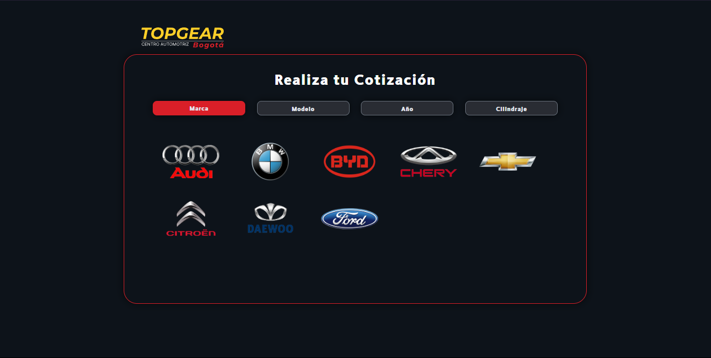
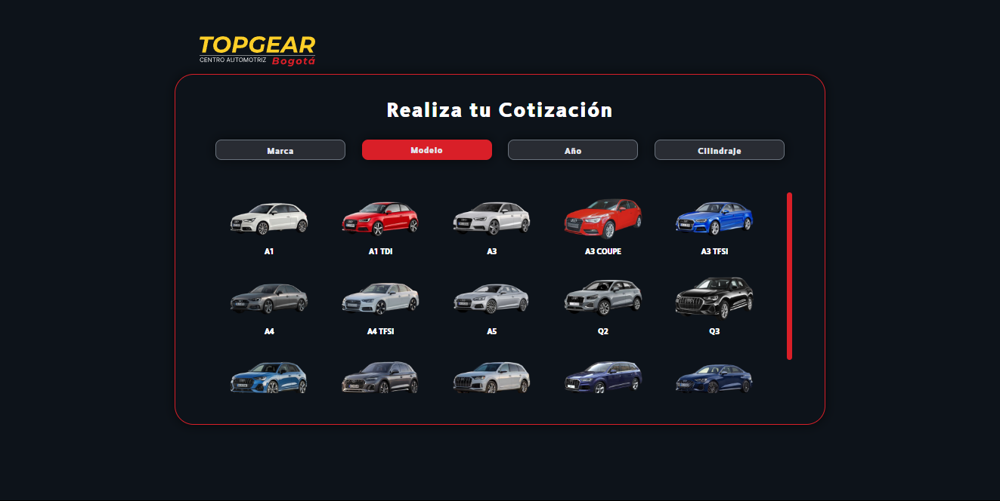
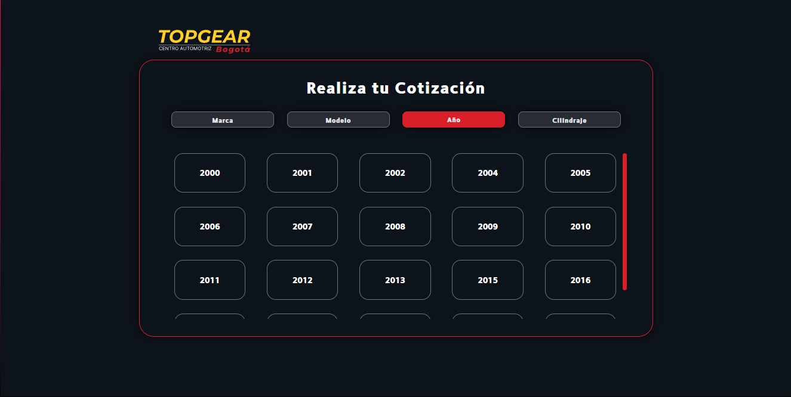
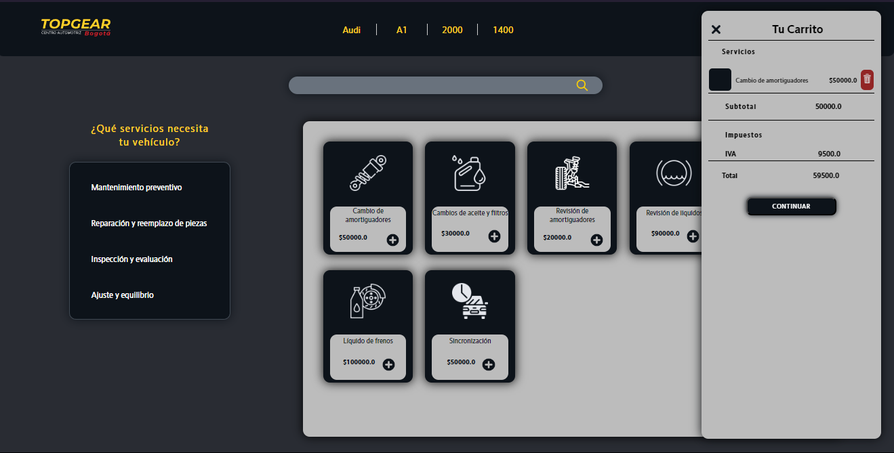
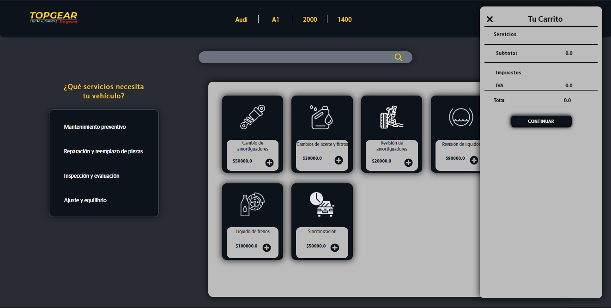
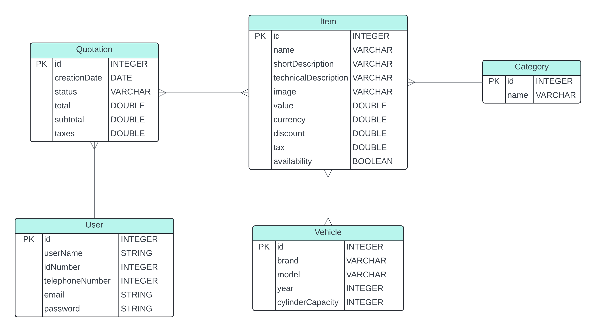
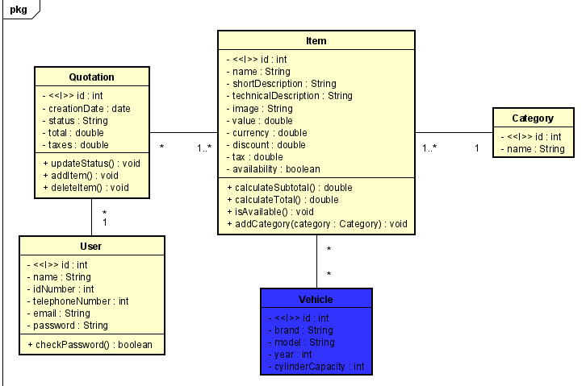
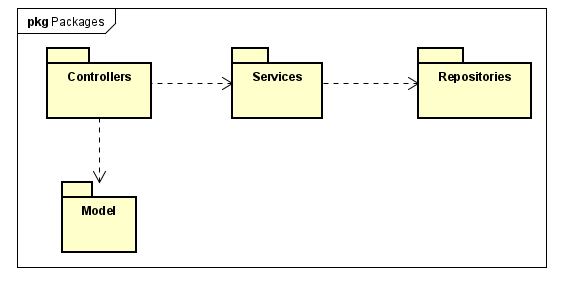
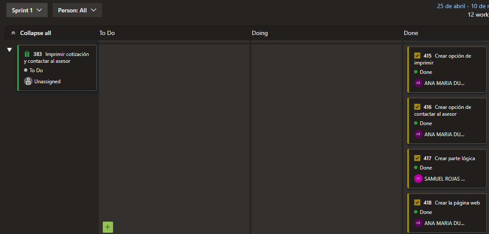
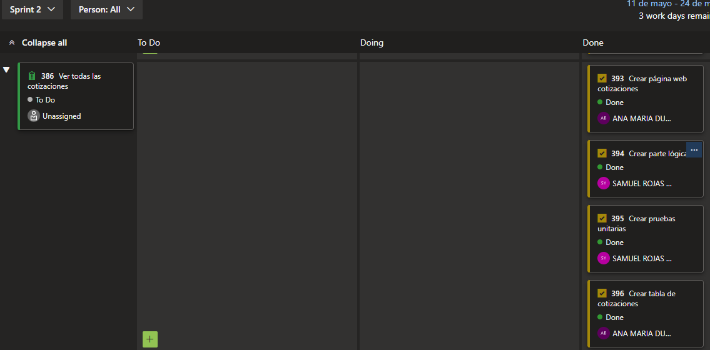

# PROYECTO FINAL - CICLO DE VIDA DEL DESARROLLO DE SOFTWARE

# CONDICIONES DE ENTREGA:
## Nombre del proyecto: 

- **Período Académico**
  - 7 Semestre

- **Nombre del Curso**
  - Ciclo de vida del desarrollo de Software

- **Nombre de los Integrantes**
  - Ana María Durán Burgos (Developer)
  - Juan David Contreras Becerra (Scrum Master)
  - Johan Alejandro Estrada Pastrán (Developer)
  - Samuel Rojas Yopasa (Developer)

- **Nombre del Profesor**
  - Iván Darío Lemus Moya (Product Owner)

## Descripción del producto.

El producto realizado es un cotizador web que permite seleccionar distintos productos por medio de una clasificación entre categorías,
la adición de estos a un carrito de compras al cual agregar y eliminar los servicios junto con un resumen pequeño del subtotal de la
compra, el costo de los impuestos y el valor total a pagar.

Al finalizar generará una factura con la compra la cual se podrá imprimir o pedir la ayuda de un asesor para continuar con el proceso de
cotización.

También cuenta con un módulo que permite agregar nuevos servicios que se pueden ofrecer en la página, además de actualizarlos, eliminarlos
y visualizarlos. Esta sección también deja visualizar el listado de cotizaciones que se han realizado en la página web junto con un resumen
de lo que tiene cada una de ellas.

Este cotizador se puede utilizar para cualquier propósito, esta vez se usó en los servicios que ofrece un taller automotriz.

## Descripción general.

- Módulo Público
  - Selección de vehículo para solicitar el servicio.

  - Selección de servicios distribuidos por categorías.

  - Agregar y eliminar servicios de la cotización y un resumen de esta.

  - Impresión de la cotización realizada.

  - Contacto con asesor para continuar con el proceso.

- Módulo Privado
  - Login de acceso para el administrador.

  - Visualización y detalle de las cotizaciones vigentes.

  - Módulo CRUD para los servicios.

## Arquitectura y Diseño detallado:
 - Modelo E-R.

 - Diagrama de clases.

 - Descripción de la arquitectura (capas) y del Stack de tecnologías utilizado.

**Arquitectura**

La arquitectura que se utilizó fue la arquitectura MVC (Modelo - Vista - Controlador) y se dividió de la siguiente 
forma, el modelo se repartió en lo que son clases que representan a nuestra base de datos, los servicios que
interactúan con los modelos y repositorios, por último los repositorios que se comunican directamente con la base
de datos. A continuación se represetan su interacción por medio del siguiente diagrama.

**Stack de tecnologías**

Para este proyecto se usaron las siguientes tecnologías:
 - Spring Framework
 - Spring Data Jpa
 - Thymeleaf
 - Base de datos H2
 - Jacoco

## Descripción del proceso:
 - Breve descripción de la Metodología.

    La metodología que usamos fue la metodología SCRUM en ella 

 - Enlace al backlog de AzureDevops.

Enlace al [backlog](https://dev.azure.com/ivanlemus0422/cvds-2024-I-agile-dev/_backlogs/backlog/cvds-2024-I-agile-dev%20Team/Issues)

 - Reporte de pruebas y de cubrimiento de las mismas (JUnit test).

**Nota**: Las pruebas unitarias fallan si se realiza la inserción de datos en el archivo data.sql, por tanto 
se deben eliminar todas las inserciones excepto la inserción a la tabla configuration.
 
### Sprint 2:

### Sprint 3:

